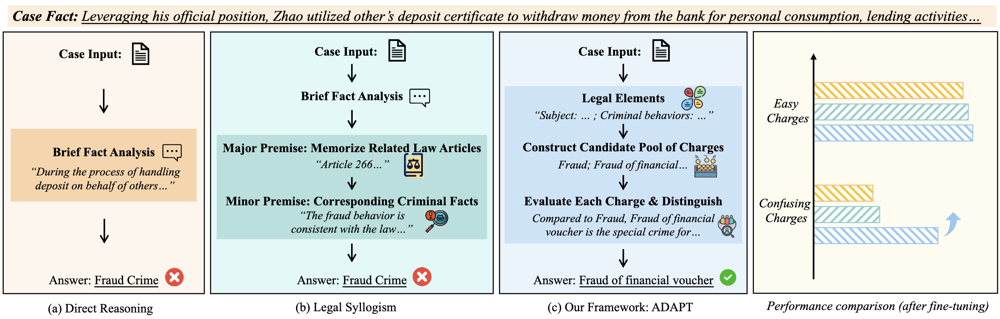

<div align="center">
<h1>Enabling Discriminative Reasoning in LLMs for Legal Judgment Prediction[<a href="https://arxiv.org/abs/2407.01964">Paper</a>]</h1>

</div>

## Released Resources
- 🤗The Huggingface model: Based on Qwen2-7B, we trained a model using the CAIL2018 dataset. [Qwen2-7B-CAIL2018-step-8765](https://huggingface.co/ChenlongDeng/ADAPT-Qwen2-7B-CAIL2018-step-8765)
- The training trajectories: We release the 80,141 training trajectories of the CAIL2018 dataset in [this link](https://pan.baidu.com/s/1HkLTedi1r6WB0CBvH5dtrA?pwd=p9ex)

## Supported Prompts
❗️Note: Our released model needs the `Qwen chat_template` to conduct correct generation.

We support the following four prompts to enable reasoning. You should use `the same input format and prompt` to achieve the best performance.

### Prompt 1: ADAPT Reasoning
```python
case_input = f"案件描述：{description}\n被告人姓名：{defendant_name}"
prompt = "请你采用ADAPT框架分析以上案件中该被告人可能被判处的罪名、适用法条和刑期"
model_input_str = '\n'.join(case_input, prompt)
```


### Prompt 2: Ask
```python
case_input = f"案件描述：{description}\n被告人姓名：{defendant_name}"
prompt = "请你用法律理论分析以上案件中该被告人在行为主体，起因、行为和结果，行为对象，犯罪主观四个方面的信息"
model_input_str = '\n'.join(case_input, prompt)
```

### Prompt 3: Article
```python
case_input = f"案件描述：{description}\n被告人姓名：{defendant_name}"
prompt = "请你依次列出以上案件中被告人适用的法条具体内容，以及适用该法条的原因"
model_input_str = '\n'.join(case_input, prompt)
```

### Prompt 4: Sentencing factors
```python
case_input = f"案件描述：{description}\n被告人姓名：{defendant_name}\n罪名：{crimes}" # e.g., 污染环境罪
prompt = "请你分析以上案件中的量刑区间和量刑因素，并给出最后的量刑预测结果"
model_input_str = '\n'.join(case_input, prompt)
```


## Citation
```
@misc{deng2024enablingdiscriminativereasoningllms,
      title={Enabling Discriminative Reasoning in LLMs for Legal Judgment Prediction}, 
      author={Chenlong Deng and Kelong Mao and Yuyao Zhang and Zhicheng Dou},
      year={2024},
      eprint={2407.01964},
      archivePrefix={arXiv},
      primaryClass={cs.CL},
      url={https://arxiv.org/abs/2407.01964}, 
}
```
